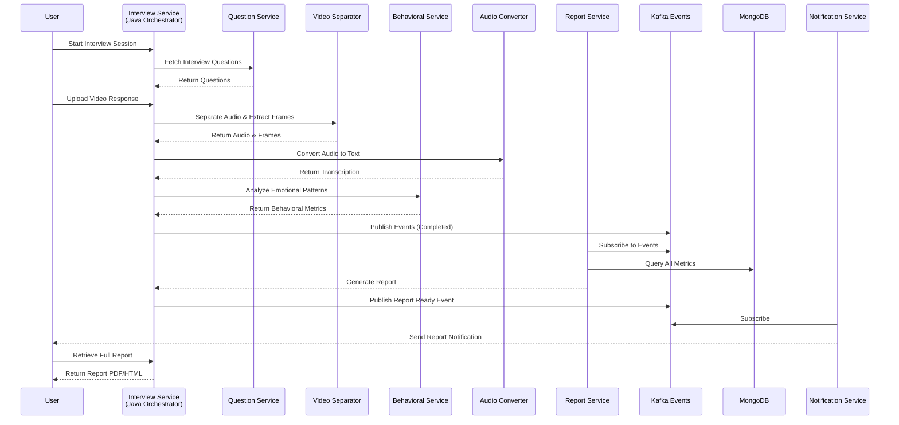

# <p align="center">🚀 InterviewMate — The Future of Interview Prep Platform 2026</p>

<p align="center">
  
  
  
  
  
  
</p>

---

## 🌌 Overview

**InterviewMate** is an next-generation, distributed microservice ecosystem engineered to revolutionize enterprise-level interview preparation and assessment. This platform leverages **Spring Boot 4.0.3**, **Advanced AI/ML**, **Real-time Streaming**, and **Containerized Architecture** to deliver an intelligent, scalable, and high-performance environment for users to master their career goals through data-driven insights and adaptive learning pathways.

### 🎯 Core Mission
- **Democratize Interview Preparation** through AI-powered mock interviews with behavioral analysis
- **Real-time Performance Analytics** with video/audio processing and emotional intelligence detection
- **Intelligent Question Generation** leveraging multi-modal AI capabilities
- **Comprehensive Report Generation** with actionable insights and progression tracking

---

## 🛠 Tech Stack — The Intelligence Engine

| Category | Technology | Version |
| :--- | :--- | :--- |
| **Core Framework** |  | **4.0.3** |
| **Language** |  | **JDK 21** |
| **Service Discovery** |  | **Spring Cloud 2025.1.0** |
| **API Gateway** |  | **2025.1.0** |
| **Databases** |   | **Latest** |
| **Message Queue** |  | **Latest** |
| **Caching Layer** |  | **Latest** |
| **Python Stack** |   | **Latest** |
| **ML/AI Libraries** | DeepFace, MediaPipe, OpenCV, HuggingFace, Google Generative AI | **Latest** |
| **Containerization** |   | **Latest** |
| **Reverse Proxy** |  | **Latest** |

---

## 🏗 System Architecture Diagram

```mermaid
graph TD
    Client["🌐 Client Requests"] --> Gateway["🚪 API Gateway:8080"]
    Gateway --> Eureka["🔭 Service Discovery:8761"]
    
    subgraph "Java Microservices Backend"
        Gateway --> UserService["👤 User Service:8081"]
        Gateway --> InterviewService["🎤 Interview Service:8086"]
        Gateway --> CodingService["💻 Coding Service:8083"]
        Gateway --> ResumeService["📄 Resume Service"]
        Gateway --> NotificationService["🔔 Notification Service:8082"]
        Gateway --> ConfigServer["⚙️ Config Server:8888"]
    end
    
    subgraph "AI/ML Python Microservices"
        InterviewService -.->|orchestrates| AudioConverter["🔊 Audio Answer Converter"]
        InterviewService -.->|controls| BehavioralAnalysis["🧠 Behavioral Analysis Service"]
        InterviewService -.->|manages| VideoAudioSeparator["📹 Video Audio Separator"]
        InterviewService -.->|retrieves| IntQuestions["📚 Interview Question Service"]
        InterviewService -.->|generates| IntReport["📊 Interview Report Service"]
        InterviewService -.->|communicates| ClientService["🔗 Client Service"]
    end
    
    subgraph "Data & Persistence Layer"
        UserService --> MySQL[(MySQL DB)]
        InterviewService --> MongoDB[(MongoDB\nInterview Data)]
        BehavioralAnalysis --> MongoDB
        IntQuestions --> MongoDB
        IntReport --> MongoDB
        ResumeService --> Redis[(Redis Cache)]
    end
    
    subgraph "Message Queue & Events"
        InterviewService --> Kafka["📩 Apache Kafka"]
        BehavioralAnalysis --> Kafka
        IntReport --> Kafka
        CodingService --> Kafka
    end
    
    subgraph "Code Evaluation"
        CodingService --> JudgeWorker["⚙️ Judge Worker"]
        JudgeWorker --> Judge0["🏛️ Judge0 API"]
    end

    classDef javaService fill:#4CAF50,stroke:#2E7D32,stroke-width:2px,color:#fff;
    classDef pythonService fill:#FF9800,stroke:#E65100,stroke-width:2px,color:#fff;
    classDef infrastructure fill:#2196F3,stroke:#1565C0,stroke-width:2px,color:#fff;
    classDef database fill:#9C27B0,stroke:#6A1B9A,stroke-width:2px,color:#fff;
    
    class UserService,InterviewService,CodingService,ResumeService,NotificationService,ConfigServer,Gateway javaService;
    class AudioConverter,BehavioralAnalysis,VideoAudioSeparator,IntQuestions,IntReport,ClientService pythonService;
    class Kafka,Eureka,JudgeWorker,Judge0 infrastructure;
    class MySQL,MongoDB,Redis database;
```



---

## 🎯 Microservice Breakdown & Detailed Architecture

### 👤 **User Service** — Auth & Identity Management
> *The Foundation of Trust*
- **Language:** Java (Spring Boot 4.0.3)
- **Port:** `8081`
- **Role:** Centralized authentication, JWT-based security, user profiles, role management
- **Database:** MySQL with transactional integrity
- **Key Features:**
  - OAuth2/JWT token generation and validation
  - Profile management and user metadata
  - Role-based access control (RBAC)
  - Integration with Eureka service discovery

---

### 🎤 **Interview Service** — The Orchestration Hub (Java/Spring Boot)
> *The Master Conductor of Interview Intelligence*
- **Language:** Java (Spring Boot 4.0.3)
- **Port:** `8086`
- **Framework:** Spring Cloud, Kafka, MongoDB Reactive
- **Role:** Central orchestrator that coordinates all AI/ML microservices with real-time event streaming

#### 📋 Internal Architecture & Components

```
interview-service/
├── InterviewServiceApplication.java      [Main Spring Boot Entry Point]
├── api/                                   [REST Controllers & Endpoints]
│   ├── InterviewController.java
│   ├── ReportController.java
│   ├── FeedbackController.java
│   └── ... [Additional API endpoints]
│
├── orchestration/                         [Service Orchestration Logic]
│   ├── InterviewOrchestrator.java
│   ├── AIServiceCoordinator.java
│   ├── WorkflowEngine.java
│   └── PipelineManager.java
│
├── client/                                [Feign/RestTemplate Service Clients]
│   ├── AudioConverterClient.java
│   ├── BehavioralAnalysisClient.java
│   ├── VideoAudioSeparatorClient.java
│   ├── InterviewQuestionClient.java
│   ├── InterviewReportClient.java
│   └── ClientServiceComm.java
│
├── entity/                                [MongoDB Document Models]
│   ├── InterviewSession.java
│   ├── InterviewQuestion.java
│   ├── UserResponse.java
│   ├── BehavioralMetrics.java
│   ├── PerformanceScore.java
│   └── InterviewFeedback.java
│
├── dto/                                   [Data Transfer Objects]
│   ├── InterviewRequestDTO.java
│   ├── InterviewResponseDTO.java
│   ├── AudioMetadataDTO.java
│   ├── BehavioralScoreDTO.java
│   ├── ReportGenerationDTO.java
│   └── AnalyticsDTO.java
│
├── repository/                            [MongoDB Reactive Repositories]
│   ├── InterviewSessionRepository.java
│   ├── QuestionRepository.java
│   ├── BehavioralMetricsRepository.java
│   └── PerformanceRepository.java
│
├── eventhandler/                          [Kafka Event Publishing & Consuming]
│   ├── InterviewEventPublisher.java
│   ├── AnalyticsEventConsumer.java
│   ├── ReportGenerationEventListener.java
│   └── NotificationEventProducer.java
│
├── config/                                [Spring Configuration Classes]
│   ├── KafkaConfig.java
│   ├── MongoConfig.java
│   ├── FeignClientConfig.java
│   ├── WebClientConfig.java
│   └── SecurityConfig.java
│
└── constants/                             [Application Constants & Enums]
    ├── InterviewStatus.java
    ├── ScoreThresholds.java
    ├── TopicCategories.java
    └── ErrorCodes.java
```

#### 🔄 **Request-Response Flow**
```
Client Request → Interview Service API → Orchestration Engine
    ↓
Coordinates: Audio Conversion → Behavioral Analysis → Question Retrieval → Video Processing
    ↓
Aggregates: Metrics → Report Generation → Feedback Creation
    ↓
Publishes: Events to Kafka → Notification Service triggered
    ↓
Response: Complete Interview Report with Scores
```

#### 🔌 **Key Dependencies** (from pom.xml)
- `spring-boot-starter-actuator` — Health checks & monitoring
- `spring-boot-starter-data-mongodb-reactive` — Async MongoDB access
- `spring-boot-starter-kafka` — Event streaming
- `spring-cloud-starter-netflix-eureka-client` — Service discovery
- `spring-cloud-starter-config` — Centralized configuration
- `org.springframework.cloud:spring-cloud-starter-openfeign` — Declarative HTTP clients
- `jackson-databind` — JSON serialization

---

## 🤖 **Interview Service AI** — Python Microservices Ecosystem

> *The Collective Intelligence Layer*

This is a sophisticated distributed system of 6 specialized Python microservices that work in concert to deliver comprehensive interview intelligence.

### 🏗️ Overall AI System Architecture

```
Interview Service (Java) [Orchestrator]
    │
    ├─→ [1] AudioAnswerConverterService
    ├─→ [2] BehavioralAnalysisService
    ├─→ [3] VideoAudioSeperatorService
    ├─→ [4] InterviewQuestionService
    ├─→ [5] InterviewReportService
    └─→ [6] Client (Communication Hub)
    
All services → Kafka (Event Streaming) → MongoDB (Persistence)
```

---

### 1️⃣ **AudioAnswerConverterService** — Speech-to-Text Intelligence
> *Transcribes and Processes Audio Responses*

**Location:** `interview-service-ai/AudioAnswerConverterService/`

#### Purpose
- Converts candidate's spoken answers into high-quality text using **Faster-Whisper**
- Performs audio quality analysis
- Extracts linguistic features and speech patterns

#### Internal Structure
```
AudioAnswerConverterService/
├── main.py                              [Entry Point - FastAPI Application]
├── requirements.txt                     [Dependencies]
├── Dockerfile                           [Containerization Config]
├── docker-compose.audio-answer-converter.yml
├── .env                                 [Environment Variables]
├── .dockerignore
│
└── Components/
    ├── AudioProcessor.py                [Core Audio Processing]
    ├── WhisperTranscriber.py            [Speech-to-Text Conversion]
    ├── AudioQualityAnalyzer.py          [Audio Quality Assessment]
    ├── FeatureExtractor.py              [Linguistic Feature Extraction]
    ├── KafkaProducer.py                 [Event Publishing to Kafka]
    └── MongoDBConnector.py              [Persistence Layer]
```

#### Key Tech Stack
```
✓ FastAPI 0.123.0          - High-performance API framework
✓ Uvicorn 0.36.0           - ASGI server
✓ Faster-Whisper 1.2.1     - OpenAI's optimized speech recognition
✓ Kafka-Python 2.2.15      - Event streaming
✓ MongoEngine 0.29.1       - MongoDB ORM
✓ Python-dotenv 1.1.1      - Environment management
```

#### API Endpoints
```
POST   /v1/convert-audio          - Convert audio file to text
POST   /v1/analyze-speech-quality - Analyze audio quality metrics
GET    /v1/transcription/{id}    - Retrieve transcription
POST   /v1/linguistic-features   - Extract speech features
GET    /health                    - Service health check
```

#### Kafka Events Published
- `audio.transcription.completed` — When transcription is done
- `audio.quality.analyzed` — When quality analysis finishes
- `linguistic.features.extracted` — When features are extracted

---

### 2️⃣ **BehavioralAnalysisService** — Emotional Intelligence Engine
> *Analyzes Facial Expressions, Body Language & Emotional States*

**Location:** `interview-service-ai/BehavioralAnalysisService/`

#### Purpose
- Real-time facial emotion recognition using **DeepFace**
- Body language analysis using **MediaPipe**
- Eye contact detection and gaze tracking
- Confidence scoring based on visual cues
- Stress/anxiety level assessment

#### Internal Structure
```
BehavioralAnalysisService/
├── main.py                              [Entry Point - FastAPI]
├── requirements.txt                     [Dependencies]
├── Dockerfile
├── docker-compose.behavioral-analysis.yml
├── .env
│
├── Components/
│   ├── FaceDetector.py                  [Face Detection & Alignment]
│   ├── EmotionAnalyzer.py               [Emotion Recognition - DeepFace]
│   ├── PoseEstimator.py                 [Body Pose Analysis - MediaPipe]
│   ├── EyeContactDetector.py            [Eye Contact & Gaze Tracking]
│   ├── ConfidenceScorer.py              [Overall Confidence Scoring]
│   ├── StressDetector.py                [Stress Level Assessment]
│   ├── VideoProcessor.py                [Frame Extraction & Processing]
│   ├── KafkaProducer.py                 [Event Publishing]
│   └── MongoDBConnector.py
│
└── Video/                               [Sample videos for testing]
    └── sample_interview_video.mp4
```

#### Advanced Tech Stack
```
✓ OpenCV-Python-Headless 4.11.0.86  - Computer Vision processing
✓ DeepFace 0.0.93                    - Facial emotion & demographic analysis
✓ MediaPipe 0.10.14                  - Pose & hand gesture detection
✓ TensorFlow 2.16.1 + Keras          - Deep learning backend
✓ NumPy 1.26.4                       - Numerical computing
✓ Kafka-Python 2.2.15                - Event streaming
```

#### API Endpoints
```
POST   /v1/analyze-emotions             - Analyze emotional expressions
POST   /v1/analyze-posture              - Detect body language
POST   /v1/eye-contact-detection        - Measure eye contact
POST   /v1/confidence-score             - Calculate confidence metrics
POST   /v1/stress-level                 - Assess stress indicators
GET    /v1/analysis/{session_id}       - Retrieve analysis results
GET    /health
```

#### Output Metrics
- **Emotions:** Happy, Sad, Angry, Fearful, Disgusted, Neutral, Surprised
- **Confidence Score:** 0-100 scale
- **Eye Contact %:** Percentage of time maintaining eye contact
- **Posture Quality:** Upright/Slouching assessment
- **Stress Level:** Low/Medium/High
- **Overall Behavioral Score:** Composite metric

#### Kafka Events
- `behavior.emotion.detected` → Emotional state changes
- `behavior.posture.analyzed` → Posture assessment
- `behavior.eyecontact.measured` → Eye contact metrics
- `behavior.confidence.computed` → Confidence scores

---

### 3️⃣ **VideoAudioSeperatorService** — Media Decomposition Engine
> *Separates Video & Audio Streams with Precision*

**Location:** `interview-service-ai/VideoAudioSeperatorService/`

#### Purpose
- Extracts audio from video files with minimal quality loss
- Separates audio tracks (voice, background noise)
- Video quality assessment
- Frame extraction for behavioral analysis
- Synchronization preservation

#### Internal Structure
```
VideoAudioSeperatorService/
├── main.py                              [Entry Point]
├── requirements.txt
├── Dockerfile
├── docker-compose.video-audio-seperator.yml
├── .env
│
├── Components/
│   ├── VideoExtractor.py                [Video Stream Processing]
│   ├── AudioExtractor.py                [Audio Stream Extraction]
│   ├── AudioNoiseFilter.py              [Noise Reduction]
│   ├── FrameExtractor.py                [Video Frame Sampling]
│   ├── SynchronizationManager.py        [A/V Sync Verification]
│   ├── FormatConverter.py               [Container Format Conversion]
│   ├── QualityAnalyzer.py               [Media Quality Assessment]
│   ├── StorageManager.py                [File Management]
│   ├── KafkaProducer.py
│   └── MongoDBConnector.py
│
├── Audio/                               [Separated audio files storage]
└── Video/                               [Frame extractions storage]
```

#### Key Technologies
```
✓ MoviePy 1.0.3             - Video processing framework
✓ FFmpeg (via MoviePy)      - Core codec handling
✓ Scipy/NumPy              - Signal processing
✓ Kafka-Python
```

#### API Endpoints
```
POST   /v1/separate-video-audio          - Extract audio from video
POST   /v1/extract-frames                - Sample frames from video
GET    /v1/audio/{stream_id}            - Retrieve separated audio
GET    /v1/video-quality/{id}           - Get quality metrics
POST   /v1/noise-filter                  - Apply noise removal
GET    /health
```

#### Kafka Events
```
media.separation.started
media.separation.completed
media.quality.analyzed
frames.extracted
audio.extracted
```

---

### 4️⃣ **InterviewQuestionService** — Intelligent Question Generation Engine
> *Generates Job-Relevant Questions with AI Precision*

**Location:** `interview-service-ai/InterviewQuestionService/`

#### Purpose
- Generates contextual interview questions based on job description
- Supports multiple interview types (behavioral, technical, situational)
- Question difficulty scaling
- PDF parsing and content extraction
- Multi-modal question generation using **Google Generative AI**

#### Internal Structure
```
InterviewQuestionService/
├── main.py                              [Entry Point - FastAPI]
├── requirements.txt
├── Dockerfile
├── docker-compose.interview-question.yml
├── VERSION                              [Service Version]
├── .env
│
├── app/
│   ├── main.py                          [FastAPI Application]
│   ├── models.py                        [Pydantic Models/Schemas]
│   ├── config.py                        [Configuration Management]
│   ├── dependencies.py                  [Dependency Injection]
│   │
│   ├── services/
│   │   ├── QuestionGenerator.py         [AI Question Generation]
│   │   ├── PDFProcessor.py              [PDF Parsing & Extraction]
│   │   ├── JobDescriptionAnalyzer.py    [Job Desc Analysis]
│   │   ├── DifficultyScaler.py          [Question Difficulty Adjustment]
│   │   ├── QuestionRepository.py        [DB Operations]
│   │   └── KafkaProducer.py
│   │
│   └── routes/
│       ├── questions.py                 [Question Endpoints]
│       ├── generation.py                [Generation Endpoints]
│       └── health.py                    [Health Checks]
│
└── pdf/                                 [PDF Documents Storage]
    └── sample_jd.pdf
```

#### Advanced Tech Stack
```
✓ FastAPI 0.123.0
✓ Uvicorn 0.36.0
✓ Google Generative AI 0.8.5             - Gemini API for question generation
✓ Google API Python Client 2.179.0
✓ PyPDF2 3.0.1 / python-docx 1.2.0     - Document parsing
✓ Pydantic 2.11.7                       - Data validation
✓ MongoEngine 0.29.1
✓ Kafka-Python 2.2.15
```

#### API Endpoints
```
POST   /v1/generate-questions            - Generate interview questions
POST   /v1/parse-job-description        - Extract JD content
POST   /v1/difficulty-adjust            - Adjust question difficulty
GET    /v1/questions/{job_id}           - Retrieve generated questions
POST   /v1/batch-generate               - Bulk question generation
GET    /health
```

#### Question Categories
```
BEHAVIORAL      → "Tell me about a time when..."
TECHNICAL       → "Explain the concept of..."
SITUATIONAL     → "How would you handle..."
ROLE_SPECIFIC   → Based on job description
COMPETENCY      → Leadership, Teamwork, Problem-solving, etc.
```

#### Kafka Events
```
questions.generated
questions.difficulty.adjusted
job_description.analyzed
```

---

### 5️⃣ **InterviewReportService** — Comprehensive Analytics & Reporting
> *Generates Professional Interview Performance Reports*

**Location:** `interview-service-ai/InterviewReportService/`

#### Purpose
- Compiles all metrics from behavioral, audio, and question analysis
- Generates professional PDF/HTML reports
- Creates interactive dashboards and visualizations
- Provides actionable feedback and improvement suggestions
- Tracks progress over multiple interview sessions

#### Internal Structure
```
InterviewReportService/
├── main.py                              [Entry Point]
├── requirements.txt
├── Dockerfile
├── docker-compose.interview-report.yml
├── .env
│
└── Components/
    ├── ReportGenerator.py               [Main Report Builder]
    ├── MetricsAggregator.py             [Metrics Compilation]
    ├── FeedbackGenerator.py             [AI-Generated Feedback]
    ├── PDFRenderer.py                   [PDF Report Creation]
    ├── HTMLRenderer.py                  [HTML Report Generation]
    ├── VisualizationEngine.py           [Charts & Graphs]
    ├── ProgressTracker.py               [Performance Progression]
    ├── RecommendationEngine.py          [Improvement Suggestions]
    ├── MongoDBConnector.py
    └── KafkaConsumer.py                 [Consumes completion events]
```

#### Tech Stack
```
✓ FastAPI 0.123.0
✓ Google Generative AI 0.8.5             - Feedback AI generation
✓ MoviePy 1.0.3                          - Multimedia handling
✓ Python-docx 1.2.0 / PyPDF2            - Document generation
✓ Matplotlib/Plotly (optional)          - Visualizations
✓ Kafka-Python 2.2.15
✓ MongoEngine 0.29.1
```

#### API Endpoints
```
POST   /v1/generate-report              - Generate comprehensive report
GET    /v1/report/{interview_id}        - Retrieve generated report
POST   /v1/generate-feedback            - AI-powered feedback
GET    /v1/progress/{user_id}           - User progression analysis
POST   /v1/recommendations              - Get improvement suggestions
GET    /v1/report/pdf/{report_id}      - Download PDF report
GET    /v1/report/html/{report_id}     - View HTML report
GET    /health
```

#### Report Sections
```
📊 SCORE SUMMARY
   ├─ Overall Performance Score (0-100)
   ├─ Communication Score
   ├─ Technical Knowledge Score
   └─ Behavioral Score

📈 DETAILED METRICS
   ├─ Emotion Analysis Results
   ├─ Speech Analysis Breakdown
   ├─ Posture & Body Language Assessment
   ├─ Eye Contact Measurements
   └─ Stress Level Timeline

💬 FEEDBACK & INSIGHTS
   ├─ AI-Generated Strengths Analysis
   ├─ Areas for Improvement
   ├─ Specific Action Items
   └─ Learning Resources

📋 COMPARISON & PROGRESS
   ├─ Performance vs. Previous Interviews
   ├─ Trend Analysis Charts
   ├─ Skill Development Timeline
   └─ Benchmark Comparisons
```

#### Kafka Events Consumed
```
audio.transcription.completed
behavior.analysis.completed
questions.answered.logged
report.requested
```

---

### 6️⃣ **Client Service** — Communication Hub
> *Bridge Between Interview Service & External Systems*

**Location:** `interview-service-ai/Client/`

#### Purpose
- Acts as a communication relay for the Interview Service (Java)
- Manages WebSocket connections for real-time updates
- Handles file uploads/downloads for interview media
- Event forwarding and load balancing

#### Internal Structure
```
Client/
├── main.py                              [Entry Point]
├── requirements.txt
├── Dockerfile
├── docker-compose-client.yml
├── .env
│
└── [Components for communication management]
    ├── WebSocketHandler.py
    ├── FileManager.py
    ├── EventForwarder.py
    ├── LoadBalancer.py
    └── MongoDBConnector.py
```

#### Tech Stack
```
✓ FastAPI 0.123.0
✓ Uvicorn 0.36.0
✓ Kafka-Python 2.2.15
✓ WebSockets support
```

---

## 🔗 **Inter-Service Communication Pattern**



---

## 🌍 Deployment Architecture

### Docker Compose Services Orchestration

#### **Main Infrastructure** (`docker-compose.infra.yml`)
```yaml
Services:
  - MySQL (Port 3306)
  - MongoDB (Port 27017)
  - Redis (Port 6379)
  - Kafka & Zookeeper (Port 9092, 2181)
  - Nginx (Port 80, 443)
```

#### **Master Compose** (`docker-compose.master.yml`)
Orchestrates ALL microservices with proper dependency management

#### **Interview Service Stack**
```yaml
interview-service:
  image: arindampal28/interviewmate-interview-service:latest
  container_name: backend-interview-service
  port: 8086
  depends_on:
    - kafka
    - config-server
    - eureka-server
  healthcheck:
    test: wget -qO- http://localhost:8086/actuator/health
    interval: 15s
    retries: 10
```

#### **Interview Service AI Stack** (Python Services)
```
Each service has its own docker-compose file:
├── docker-compose.audio-answer-converter.yml
├── docker-compose.behavioral-analysis.yml
├── docker-compose.video-audio-seperator.yml
├── docker-compose.interview-question.yml
├── docker-compose.interview-report.yml
└── docker-compose-client.yml
```

---

## 📊 Data Models & MongoDB Collections

### Core Collections in MongoDB

#### 1. **interview_sessions**
```javascript
{
  _id: ObjectId,
  user_id: String,
  job_title: String,
  interview_type: String, // BEHAVIORAL, TECHNICAL, ...
  status: String, // STARTED, IN_PROGRESS, COMPLETED
  created_at: DateTime,
  completed_at: DateTime,
  total_duration_seconds: Number,
  overall_score: Number
}
```

#### 2. **behavioral_metrics**
```javascript
{
  _id: ObjectId,
  interview_session_id: ObjectId,
  emotion_scores: {
    happy: Float,
    sad: Float,
    angry: Float,
    neutral: Float,
    fearful: Float
  },
  eye_contact_percentage: Float,
  posture_quality: String,
  stress_level: String,
  confidence_score: Float,
  analysis_timestamp: DateTime
}
```

#### 3. **audio_transcriptions**
```javascript
{
  _id: ObjectId,
  interview_session_id: ObjectId,
  audio_file_url: String,
  transcription_text: String,
  speech_rate_wpm: Number,
  pause_duration_seconds: Number,
  clarity_score: Float,
  transcribed_at: DateTime
}
```

#### 4. **interview_questions**
```javascript
{
  _id: ObjectId,
  job_id: String,
  category: String,
  difficulty: String, // EASY, MEDIUM, HARD
  question_text: String,
  answer_expected: String,
  candidates_response: String,
  scoring_rubric: Object
}
```

#### 5. **interview_reports**
```javascript
{
  _id: ObjectId,
  interview_session_id: ObjectId,
  overall_performance: Number,
  communication_score: Number,
  technical_score: Number,
  behavioral_score: Number,
  strengths: [String],
  improvements: [String],
  recommendations: [String],
  report_url: String,
  generated_at: DateTime
}
```

---

## 🚀 Deployment & Scaling Instructions

### Local Development Setup
```bash
# 1. Clone repository
git clone <repo-url>
cd backend

# 2. Start infrastructure
docker-compose -f docker-compose.infra.yml up -d

# 3. Start core services
docker-compose -f docker-compose.master.yml up -d

# 4. Verify all services are healthy
curl http://localhost:8761  # Eureka Dashboard
```

### Kubernetes Deployment (Production)
```bash
# Apply manifests
kubectl apply -f k8s/namespaces/
kubectl apply -f k8s/configmaps/
kubectl apply -f k8s/secrets/
kubectl apply -f k8s/services/
kubectl apply -f k8s/deployments/

# Verify deployments
kubectl get deployments -n interviewmate
kubectl get pods -n interviewmate
```

---

## 🔐 Security & Best Practices

### Authentication & Authorization
- **JWT Tokens** with 24-hour expiration
- **Role-Based Access Control** (RBAC)
- **API Key** management for external integrations
- **OAuth2** support for third-party logins

### Data Protection
- **SSL/TLS** encryption for all traffic
- **MongoDB Encryption** at rest
- **Sensitive Data** masking in logs
- **GDPR Compliance** for user data

### Monitoring & Observability
- **Spring Boot Actuator** health endpoints
- **Prometheus** metrics collection
- **Grafana** dashboards
- **ELK Stack** for centralized logging
- **Distributed Tracing** with Sleuth & Zipkin

---

## 📚 API Documentation & Testing

### Swagger/OpenAPI Documentation
```
http://localhost:8080/swagger-ui.html
http://localhost:8080/v3/api-docs
```

### Kafka Topics Monitoring
```bash
docker exec -it kafka kafka-topics --bootstrap-server localhost:9092 --list
docker exec -it kafka kafka-console-consumer --bootstrap-server localhost:9092 --topic <topic-name>
```

### Database Access
```bash
# MongoDB
mongosh mongodb://localhost:27017

# MySQL
mysql -u root -p interviewmate_db
```

---

## ⚡ Quick Start — Launch the Future

### 1. Prerequisites
- **JDK 21+** (Java Development Kit)
- **Python 3.10+** (for AI/ML services)
- **Docker Desktop 4.0+** (with Compose)
- **Maven 3.8.1+** (for building)
- **Git** (for version control)
- **Memory:** Minimum 8GB RAM recommended
- **Disk Space:** Minimum 20GB for Docker images

### 2. Environment Setup
```bash
# Clone the repository
git clone https://github.com/your-org/interviewmate-backend.git
cd backend

# Copy environment files
cp .env.example .env
# Edit .env with your credentials

# Create external Docker network
docker network create interviewmate-network
```

### 3. Start Infrastructure Services
```bash
# Start MySQL, MongoDB, Redis, Kafka, Nginx
docker-compose -f docker-compose.infra.yml up -d

# Wait 30 seconds for services to bootstrap
sleep 30

# Verify infrastructure health
docker-compose -f docker-compose.infra.yml ps
```

### 4. Start Core Java Microservices
```bash
# Start Config Server
docker-compose -f config-server/docker-compose.config.yaml up -d

# Wait for Config Server to be ready
sleep 20

# Start Eureka Server
docker-compose -f eureka-server/eureka-server/docker-compose.eureka.yml up -d

# Start API Gateway
docker-compose -f api-gateway/api-gateway/docker-compose.gateway.yml up -d

# Start remaining services
docker-compose -f interview-service/interview-service/docker-compose.interview.yml up -d
docker-compose -f coding-service/coding-service/docker-compose.coding.yml up -d
docker-compose -f user-service/user-service/docker-compose.user.yml up -d
docker-compose -f notification-service/notification-service/docker-compose.notification.yml up -d
docker-compose -f resume-service/resume-service/docker-compose.resume.yml up -d

# Verify all services
docker-compose -f docker-compose.master.yml ps
```

### 5. Start Python AI Microservices
```bash
# Start AI Services (requires Python 3.10+)
cd interview-service-ai

docker-compose -f AudioAnswerConverterService/docker-compose.audio-answer-converter.yml up -d
docker-compose -f BehavioralAnalysisService/docker-compose.behavioral-analysis.yml up -d
docker-compose -f VideoAudioSeperatorService/docker-compose.video-audio-seperator.yml up -d
docker-compose -f InterviewQuestionService/docker-compose.interview-question.yml up -d
docker-compose -f InterviewReportService/docker-compose.interview-report.yml up -d
docker-compose -f Client/docker-compose-client.yml up -d
```

### 6. Health Verification
```bash
# Check Eureka Dashboard
curl http://localhost:8761

# Check API Gateway
curl http://localhost:8080/actuator/health

# Check Interview Service
curl http://localhost:8086/actuator/health

# Check MongoDB
docker exec -it mongodb mongosh mongodb://localhost:27017

# Check Kafka
docker exec -it kafka kafka-broker-api-versions.sh --bootstrap-server localhost:9092

# Check Redis
redis-cli -h localhost ping
```

### 7. Access Points
```
🌐 API Gateway        → http://localhost:8080
🔭 Eureka Dashboard   → http://localhost:8761
⚙️ Config Server      → http://localhost:8888
🎤 Interview Service  → http://localhost:8086
📄 Swagger UI         → http://localhost:8080/swagger-ui.html
```

---

## 🐛 Troubleshooting Guide

| Issue | Solution |
|-------|----------|
| **Port Already in Use** | `docker ps` find and kill conflicting container |
| **Out of Memory** | Increase Docker memory allocation in settings |
| **Service Discovery Fail** | Ensure Eureka server is running first |
| **MongoDB Connection Error** | Check MongoDB container logs: `docker logs mongodb` |
| **Kafka Connection Fail** | Verify network: `docker network ls` |
| **Python Service Crashes** | Install GPU drivers for ML services (optional) |

---

## 📈 Performance Optimization

### Caching Strategy
- Redis caching for frequently accessed questions
- MongoDB indexes on `user_id`, `interview_session_id`
- Kafka topic partitioning for parallel processing

### Scaling
- Horizontal scaling of Python AI services (stateless)
- Load balancing via Nginx
- Database connection pooling

---

## 🤝 Contributing Guidelines

1. Create feature branch: `git checkout -b feature/amazing-feature`
2. Commit with clear messages: `git commit -m 'Add amazing feature'`
3. Push to branch: `git push origin feature/amazing-feature`
4. Open Pull Request with detailed description

---

## 📄 License
This project is licensed under the **MIT License**

---

## 🙋 Support & Community

- **Documentation:** [Link to Docs]
- **Issues:** GitHub Issues
- **Discussions:** GitHub Discussions
- **Email:** support@interviewmate.dev

---

<p align="center"> <strong>Built with ❤️ for Interview Excellence</strong> | <strong>2026 & Beyond</strong> </p>
# Clone the repository
git clone https://github.com/MrPal28/InterviewMate-V1-backend
cd InterviewMate-V1-backend

# Launch the entire ecosystem
docker compose -f docker-compose.master.yml up -d
```

### 3. Monitoring
- **Control Center (Eureka):** [http://localhost:8761](http://localhost:8761)
- **API Gateway (Edge):** [http://localhost:8080](http://localhost:8080)

---

## 🧩 How to Contribute

We are building the future together. 

1. **Fork** the repository
2. **Branch**: `git checkout -b feature/awesome-new-feature`
3. **Commit**: `git commit -m "Add something incredible"`
4. **Push**: `git push origin feature/awesome-new-feature`
5. **Request**: Open a Pull Request

---

<p align="center">
  <b>Built with ❤️ by InterviewMate Team.</b><br>
  <i>Mastering the art of interviewing, one service at a time.</i>
</p>
