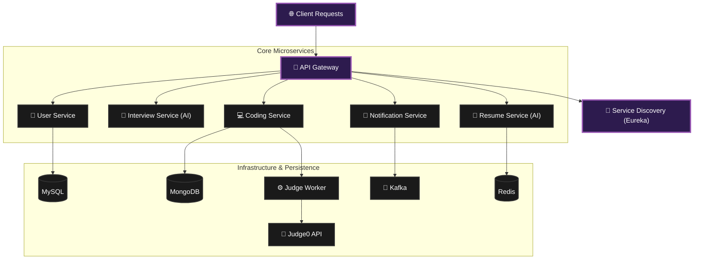

# <p align="center">🚀 InterviewMate — The Future of Interview Prep</p>

<p align="center">
  
  
  
  
</p>

---

## 🌌 Overview

**InterviewMate** is a cutting-edge, microservice-driven backend ecosystem engineered to revolutionize interview preparation. Leveraging **Spring Cloud**, **AI-assistants**, and **Scalable Containers**, it provides a seamless and high-performance environment for users to master their career goals.

---

## 🛠 Tech Stack — The Engine Room

| Category | Technology |
| :--- | :--- |
| **Core Framework** |   |
| **Microservices** |   |
| **Databases** |   |
| **Real-time / Caching** |   |
| **Infrastructure** |   |
| **Evaluation** |  |

---

## 🏗 System Architecture



---

## 🛰 Microservice Breakdown

### 👤 User Service
> *The Authentication Hub*
- **Role:** Handles registration, JWT-based security, and profile management.
- **Port:** `8081`

### 🎤 Interview Service (AI-Powered)
> *The AI Mock Interviewer*
- **Role:** Conducts simulated AI-driven interviews with real-time scoring.
- **Port:** `8084`

### 💻 Coding Service
> *The Practice Engine*
- **Role:** Recommends topics and tracks coding sessions via Judge0 integration.
- **Port:** `8083`

### 📄 Resume Service
> *The Career Architect*
- **Role:** AI-powered resume analyzer and professional builder.
- **Port:** `8086`

### 🔔 Notification Service
> *The Messenger*
- **Role:** Centralized system for email and real-time alerts via Kafka.
- **Port:** `8082`

---

## ⚡ Quick Start — Launch the Future

### 1. Requirements
- **JDK 21**
- **Docker Desktop**
- **Maven**

### 2. Initiation
```bash
# Clone the repository
git clone https://github.com/MrPal28/InterviewMate-V1-backend
cd InterviewMate-V1-backend

# Launch the entire ecosystem
docker compose -f docker-compose.master.yml up -d
```

### 3. Monitoring
- **Control Center (Eureka):** [http://localhost:8761](http://localhost:8761)
- **API Gateway (Edge):** [http://localhost:8080](http://localhost:8080)

---

## 🧩 How to Contribute

We are building the future together. 

1. **Fork** the repository
2. **Branch**: `git checkout -b feature/awesome-new-feature`
3. **Commit**: `git commit -m "Add something incredible"`
4. **Push**: `git push origin feature/awesome-new-feature`
5. **Request**: Open a Pull Request

---

<p align="center">
  <b>Built with ❤️ by InterviewMate Team.</b><br>
  <i>Mastering the art of interviewing, one service at a time.</i>
</p>
